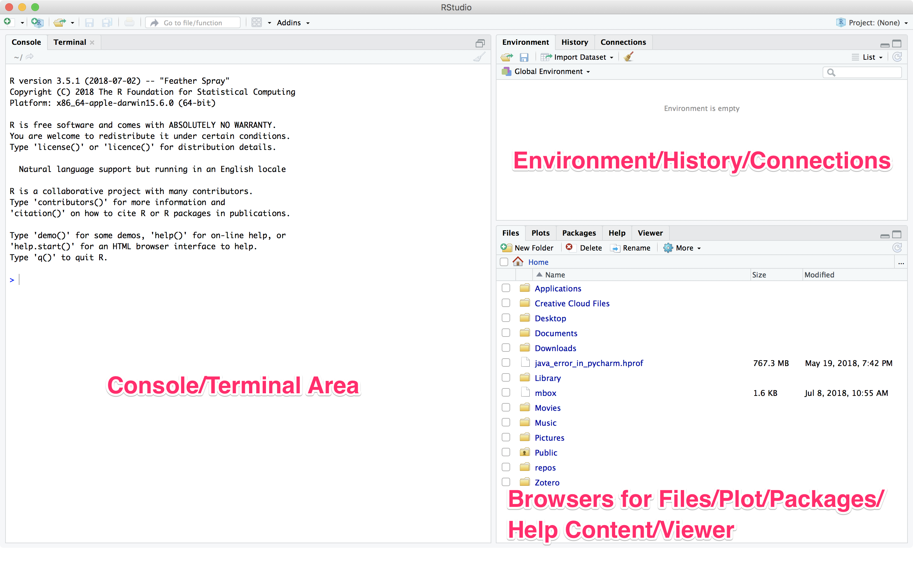

# What is R?

R is an [Open Source](https://opensource.org) programming language that is specifically designed for data analysis, especially statistical analyses, and visualization. It consists of the [core R system](https://cran.r-project.org) and a collection of (currently) over [13,000 packages](http://cran.cnr.berkeley.edu) that provide specialized data manipulation, analysis, and visualization capabilities. R is an implementation of the *S* statistical language developed in the mid-1970s at Bell Labs, with the start of development in the early 1990s and a stable beta version available by 2000. R has been under continuous development for over 25 years and has hit major development [milestones](https://en.wikipedia.org/wiki/R_\(programming_language\)#Milestones) over that time. 

R syntax is relatively straighforward and is based on a core principle of providing reasonable default values for many functions, and allowing a lot of flexibility and power through the use of optional parameters. 

R is an interpreted language. R code does not have to be compiled, but can be executed immediately through an interpreter. When you installed R, it came with an interpreter. Today we are not going to use the default interpreter - we're going to use RStudio, which is an IDE (integrated development environment).

**Note**: RStudio does not come with R, which must be installed separately. 

# What is RStudio?

RStudio is an [integrated development environment](https://en.wikipedia.org/wiki/Integrated_development_environment) (IDE) for R that provides an efficient environment for writing, executing, debugging, and viewing output generated by R commands and scripts. 




RStudio is not a Graphical User Interface for the R language that "protects" you from needing to enter R commands (except for a small number of commands that are in the interface that display data frames and other environment objects), instead it brings together a powerful set of tools that streamline the process of incrementally developing an analysis. Some key components of the RStudio environment include:

* An integrated file browser that you can use to navigate to and open files associated with your project
* A plot viewer that displays plots generated by R commands that are executed in the console, or through an R script file
* A panel that displays the currently installed packages and indicates whether or not they have been loaded into the current environment
* A panel in which help information is displayed when help functions are executed
* A console that continuously displays the executed commands and their output. Individual R commands can also be typed directly into the console for execution outside of any other scripts or notebook files you might be editing and executing. 
* A terminal interface where you can type in commands as if they were at the command line of the computer on which you are running RStudio
* A panel in which the content of the current environment (dataframes/tibbles, variables) is displayed and accessible. 
* An editor that provides code completion for R syntax being entered into R syntax files or R notebook files

Let's look at the RStudio interface and poke around some ...

# Why would you use R and RStudio?

You can write R code in any text editor and execute R code from the command line so why would you use RStudio (or another IDE) to develop your analysis? Basically, because the development of an analysis is typically an iterative and exploratory process that benefits from being able to experiment with commands and their options before commiting them to your analysis workflow. By working in an environment where you can easily type in a command and its variants into the console, script, or notebook and execute only that command and see what the output is you can quickly refine the command you use in your analysis to best meet your needs. When you are troubleshooting why a particular command is not giving you the result you want or expect you can see what the current execution environment looks like to see if there are any lingering variables, dataframes, or other stored values that may be messing up your code. The quick back and forth between code writing and testing in an IDE is a powerful and highly productive model. 

# What does an R workflow within RStudio look like?

As noted above, the development of an analysis workflow in R is a highly iterative process - both at the very low level of composing individual R commands, and at the higher level of updating the analysis based on increasing knowledge of the data and insights gained from visualizations and modeling. At one or more points in the analysis process you may need to communicate your results to others. This can be through reports, web sites, publications, or even interactive web applications. R and RStudio support all of these methods of communicating results. 

](images/rfds_00in01.png)

## Get Started Using RStudio

From the _File_ menu, select _New File_ -> _R Script_. The script will open in an editor panel. Commands can be run from the console pane, or they can be entered into the R script and executed inline. 

To run a command in the console, type in the command and hit ENTER. To run a command from a script, select the line with the code you want to run and hit CTL+ENTER.

As we saw with Python last month, R can be used like a calculator.

```{r}
2 + 3

2 * 3

12 / 3

2 ** 3

## We can also call mathematical functions
# Square root
sqrt(144)

# Natural log
log(10)

# Trig functions
sin(10)
cos(4)
tan(60)
```

# Getting help in R

R has a well established system of documentation that is reflected in all of the developed packages, some of which include sample data that can be used to test and learn about their functionality. 

* To start the browsable interface for the core R system the `help.start()` command can be executed

```{r}
help.start()
```

* The help information for specific R functions can be obtained uwing two different commands: `help()` and `?`. 

```{r}
# to see the documentation for the plot function
help(plot)
?plot
```

 * If you don't know specific function names, you can search help for functions related to certain topics.
 
 ```{r}
 # Search for trig functions
 help.search("trigenometry")
 help.search("plot")
 ```
 
# Core concepts in R 

## Packages

While the core R programming environment includes a variety of useful data import, transformation, analysis, and visualization functions, R's package environment is where the R language system shines. The tremendous collection of packages that have been developed in the R language for performing specialized analyses - often including sample data that can be used to test or learn the functionality provided by the packages. Packages are installed in your local instance of R through the `install.packages()` function and are loaded into the current environment using the `library()` function. You can browse the massive collection of packages through the *Comprehensive R Archive Network* [Contributed Packages](https://cran.r-project.org/web/packages/index.html) web page, or look through a well-curated collection of packages and other R-related materials through the [Awesome R](https://awesome-r.com/index.html) web site. 

To see what packages are currently installed on your R system you can issue the `library()` command without any options.

```{r}
library()
```

To see the list of currently loaded packages (i.e. those that have been loaded as a result of executing the `library()` command and those that automatically load when the R environment is started) you can execute the `search()` function without any options.

```{r}
search()
```

RStudio provides a package manager for installing and loading packages into the current project or environment. Packages can also be managed in the console and in scripts using the `install.packages()` and `library()` commands.

```{r}
# Install the readr package for importing tabular data from CSV
# and other text formats.
install.packages("readr")

# Load the readr package into the current environment.
library(readr)
```

## Importing and exporting data into and out of R

R supports numerous data formats and databases for [data import and export](https://cran.r-project.org/doc/manuals/r-release/R-data.pdf), including:

* Tabular ASCII text files
* Spreadsheet-like data
* Other statistical programs
* Relational databases
* A variety of binary files
* Image files
* Connections to files for reading/writing

Many specialized data formats are also supported for reading and/or writing through community contributed packages. 


## Data Models

The core data models in R are built up from lists of objects, that may be themselves made up of lists. From this primative of nested lists of objects you can have the core data structures that R uses:

* An R Vector - a collection of data of the same type (i.e. logical, integer, double, character, complex, or raw). Vectors can be created as products of functions like the `seq()` function, or can be manually created using the `c()` command. 

* An R Data frame - a collection of data organized in rows and columns in which the column names should be non-empty, row names unique, the data within the dataframe are numeric, factor (an enumerated list of values), or character type, and each column contains the same number of data items. 

* Selecting rows/columns from a data frame can be done using a variety of [subsetting commands](https://www.statmethods.net/management/subset.html)

## Data Visualization

R provides many options for data visualization through both general purpose and highly specialized packages. Some good examples of useful visualization packages can be found [here](https://blog.modeanalytics.com/r-data-visualization-packages/), [here](https://www.computerworld.com/article/2921176/business-intelligence/great-r-packages-for-data-import-wrangling-visualization.html), and [here](https://support.rstudio.com/hc/en-us/articles/201057987-Quick-list-of-useful-R-packages). 

## Data Modeling

Data modeling is supported for many disciplines and types of data. Examples of the types of analytic models that can be developed and run in R can be found in the [Awesome R](https://awesome-r.com/index.html) curated collection of recommended R packages. 


Some sample R code - just based on core R capabilities - no extra packages (`example_01.R`)

```{r}
# Do basic math - turn your computer into the most expensive pocket calculator you have ever used
2+3
23*(2^26 + 1.36)/sqrt(23e123)

# Create a vector (collection) of values to work with
# you can assign values using either the "<-" symbol or a "=". 
# The preferred method is using the "<-" for clarity
x <- c(15,18,6,56,15,28,35)
x

# Do some math with the vector
y <- x^2
y

# Calculate some statistics
mean(x)
mean(y)

var(x)
var(y)

summary(x)
summary(y)

fivenum(x)
fivenum(y)

# Generate some plots
plot(x,y)          # basic scatterplot

plot(x,y)          # same scatterplot with an added regression line for the paired x-y values 
abline(lm(y~x), col="red")

# Do some linear modeling
my_lm <- lm(y ~ x) # simple linear regression model of the form "y = B0 + (B1 * x)"
print(my_lm)       # print out the coefficients for the model
summary(my_lm)     # compute and print the more detailed statistics for the model
plot(my_lm)
```

This sample code could be run as a script from the command prompt using the command `Rscript example_01.R`


# Reference Materials

* [R Wikipedia Article](https://en.wikipedia.org/wiki/R_(programming_language))
* [RStudio Cheatsheet Collection](https://www.rstudio.com/resources/cheatsheets/)
* [Awesome R](https://awesome-r.com/index.html) R package collection
* [*R for Data Science*](http://r4ds.had.co.nz). Garrett Grolemund and Hadley Wickham. O'Reilly Media, Sebastapol, CA. 2016. 
* Quick-R [R Tutorial](https://www.statmethods.net/r-tutorial/index.html)

# Demonstration

Dependencies:

* Current release of R from the [CRAN](https://cran.r-project.org)
* [RStudio Desktop](https://www.rstudio.com/products/rstudio/download/)
* [tidyverse](https://tidyverse.tidyverse.org)