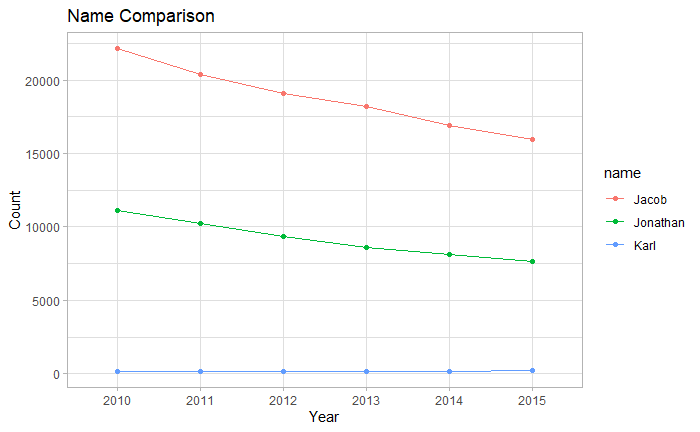

```{r setup, include=FALSE}
knitr::opts_chunk$set(echo = TRUE)
```

## About R Markdown

Markdown is a structured text format for quick document production. If you
have visited Wikipedia, you have read webpages that were written using Markdown!

Other places you may encounter or use Markdown include (but are not limited to):

- GitHub
- Open Science Framework
- Jupyter Notebooks
- Google Documents

and RStudio! All of our R tutorials are written using R Markdown.

## Creating R Markdown documents

RStudio provides support for two Markdown based file types

- Markdown
- R Markdown

The main difference between the two is that R Markdown supports code execution.
That is the format we will use for this tutorial.

1. Use the new file button or *File* menu to create a new file.
1. From the available options, select *R Markdown*.
1. When prompted, provide a name for the new document. We will explain the other
options, but will accept the default values for these.
1. When the new document is created, be sure to save it right away. Remember
that new files in RStudio are not automatically saved.

When a new R Markdown document is created, some example text and code blocks
are included. We will describe the different parts of the document and how
to render, or *knit* the output document.

The key point is that an R Markdown document includes two types of content
blocks:

- Markdown formatted text
- R code

## Markdown syntax

Markdown was initially developed as an HTML authoring tool. 

Consider - If you wanted to create a webpage without having to use HTML tags, 
you would need some other way to represent the structure of the page. Common
elements of a webpage include:

- One top level (or *level one*) header. Often this is the title of the page
- One or more second level (or *level two*) headers to break the content into
logical sections
- Additional nested levels and their corresponding headers
- Plain text
- Formatted text (**bold**, *italic*)
- Lists (ordered and un-ordered)
- Hyperlinks
- Images
- Tables

Less common elements include:

- Blockquotes
- Formatted code
- Sub and superscripted text
- Strikethrough text
- Footnotes and endnotes

Markdown has syntax for all of these page elements and more. For more detailed
information, see [Basic Syntax at the Markdown Guide](https://www.markdownguide.org/basic-syntax/).

Here we introduce the common elements listed above.

### Headers

Headers use pound signs - one for each header level.

```markdown
# Level one

## Level two

### Level three
```

The above renders as

# Level one

## Level two

### Level three


### Text

Plain text is essentially treated as-is. It is important to note that different
tools may render line breaks differently. Generally, a single carriage return
is ignored by more rendering tools.

```markdown
We can have some longer lines
and some
shorter
lines
but
note
the rendered text.
```

The above renders as:

We can have some longer lines
and some
shorter
lines
but
note
the rendered text.

Surround text with single asterisks or single underscores in order to
emphasize (italicize) it.

```markdown
*this is italicized*

_and so is this_
```
*This tex is italicized.*

_And so is this._

Surround text with double asterisks or underscores in order to bold it.

```markdown
**This is bolded text.**

__And so is this!__
```

**This is bolded text.**

__And so is this!__


Why do we have two different ways to indicate both bold and italic text?
What if want to use both bold and italics?

```markdown
_**This is bold and italicized text!**_

*__And so is this!__*

__*And me too!*__

**_Me three!_**
```

_**This is bold and italicized text!**_

*__And so is this!__*

__*And me too!*__

**_Me three!_**


### Lists

List syntax in Markdown is also flexible. One this I love about numbered lists
in Markdown is I can use the number 1 for each item in the list!

```markdown
1. Milk
1. Eggs
1. Cereal
1. Tofu
```

1. Milk
1. Eggs
1. Cereal
1. Tofu

Unordered lists can use either a single asterisk or a hyphen.

```markdown
- dog
- cat
- fish
- pizza

Works as well as

* dog 
* cat
* fish
* pizza
```

- dog
- cat
- fish
- pizza

Works as well as

* dog 
* cat
* fish
* pizza

Lists can be nested.

```markdown
1. pets
  - dog
  - cat
  - fish
2. groceries
  - milk
  - eggs
  - pizza
    * cheese
    * pepperoni
3. planets
  * mars
  * saturn
  * pluto?
```

1. pets
    - dog
    - cat
    - fish
2. groceries
    1. milk
    1. eggs
    1. pizza
        * cheese
        * pepperoni
3. planets
    * mars
    * saturn
    * pluto?


### Hyperlinks

Use angle brackets to insert a URL as-is. Here's a nice one:

<https://www.wildlife.state.nm.us/fishing/weekly-report/>

To overlay the URL with text, use square brackets for the text and
parenthesis for the URL. Make sure not to add any spaces between the
square brackets and parenthesis.

[NM Department of Game and Fish weekly stocking report](https://www.wildlife.state.nm.us/fishing/weekly-report/)

### Images

We use a similar syntax in order to insert an image. An exclamation point
before the square brackets indicates that the reference is a local file.




## R Code Cells

As noted above, unlike Markdown, R Markdown supports the insertion of cells of
executable R code. A code cell is surrounded by three tick marks, \```. The
opening tick marks are followed by a set of curly brackets that indicate the
language, in this case R, along with a description of what the code in the 
cell does and any runtime options.

When we knit an R Markdown document, all of the code cells are executed and the
results are included in the rendered output.

If we don't want to go through the process of rendering a document to 
see how our code is working, we can also use the green *run* button within
each cell to run the code in that cell individually.

```{r load_packages}
library(tidyverse)
library(readr)
library(ggplot2)
```


What is the difference between the above and below code cells when we knit
this document into HTML?


```{r load_packages_2, message=FALSE}
library(tidyverse)
library(readr)
library(ggplot2)
```

There are many different runtime options that we can use to show or hide
code and output, errors, warnings, etc. A great resources for this is the
[R Markdown Cheatsheet](https://raw.githubusercontent.com/rstudio/cheatsheets/main/rmarkdown.pdf).

### Read data

Let's read just one of our datasets into memory.

```{r read_data, message=FALSE}
names2021 <- read_csv('./data/2021')
```

And include the output of the ```head()``` function in our rendered HTML.

```{r print_head}
knitr::kable(head(names2021))
```


